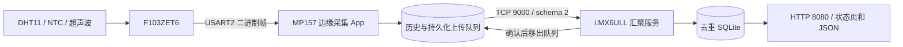

# 三板边缘数据采集网关

当前实物方案：**F103ZET6 精英板 V2.6 → STM32MP157 原厂触摸桌面 → i.MX6ULL 汇聚服务**。

当前 F103 的 CubeMX/HAL 工程已收录于 [`firmware_f103ze/`](firmware_f103ze/MDK-ARM/README.md)，Keil 入口为 `firmware_f103ze/MDK-ARM/EdgeGateway_F103ZE.uvprojx`。本仓库的 `firmware_f103/` 和 `mp157_hmi/` 是保留的旧 F103C8 标准库/Qt Widgets 方案，不是当前 ZE 桌面方案的烧录入口。

## 当前链路

- MP157 保留正点原子 `systemui`，点击「边缘采集」进入实时采集、历史记录、连接设置、汇聚上传。返回桌面继续采集，暂停采集释放串口。
- NTC 显示 ADC、毫伏和 DO；未标定时不换算温度。无效或过期实时读数显示 `--`。
- 历史与待上传记录在同一 SQLite 事务中提交。断网、应用重启后继续补传；汇聚确认后才删除队列条目。
- 上传序号独立于 F103 的 16 位序号；数据库持有稳定网关标识，避免 F103 复位/序号回绕导致误去重。
- 6ULL 区分 `schema=2 / F103ZE` 与旧 `schema=1 / F103C8`。NTC、超声波不会混入光照/模拟量字段；旧数据库自动增加列并保留记录。
- 控制下发、阈值、LED、蜂鸣器功能属于旧 C8 参考实现；当前 ZE 固件没有对应完整命令处理，桌面不展示无效按钮。

## 当前开发网络

| 设备/网卡 | 地址 | 用途 |
|---|---|---|
| Ubuntu ens33 | 192.168.88.131 | Windows SSH / NAT |
| Ubuntu ens37 | 192.168.137.2 | MP157 TFTP/NFS 与路由 |
| MP157 eth0 | 192.168.137.3 | 触屏采集 |
| Ubuntu ens38 | 192.168.138.2 | 6ULL TFTP/NFS 与路由 |
| i.MX6ULL eth0 | 192.168.138.3 | TCP 9000、HTTP 8080 |

两块板通过虚拟机的受限转发通信；两端仅增加对方 IP 的主机路由。规则只允许两个板卡地址经 ens37/ens38 互通。虚拟机必须运行，两个桥接网卡必须对应实际网线连接。

## 接线与启动

- F103 USART1 是电脑调试文字输出；USART2（PA2 TX、PA3 RX）是二进制采集帧。
- F103 USART2 → 3.3V USB-TTL → MP157 USB HOST。TX/RX 交叉并共地；已独立供电的 F103 不再接 USB-TTL 电源脚。
- MP157 继续采用已调通的 TFTP 内核/DTB＋NFS 根 `/srv/nfs/edgegateway/mp157`。
- 6ULL 使用已验证的 ENET1、TFTP 内核/DTB＋NFS 根 `/srv/nfs/edgegateway/imx6ull`。
- NFS 的新 App 不会自动出现在原 eMMC 系统里；此次应用部署不刷写 eMMC、U-Boot 或设备树。

## 验证与文档

- [桌面 App](mp157_desktop/README.md)
- [2026-09-19 接续与验收](docs/12_ZE三板接续与验收.md)
- [首次桌面安装](mp157_desktop/INSTALLATION.md)
- [TFTP/NFS 网络启动](docs/11_TFTP_NFS网络启动.md)
- [旧 C8 协议](common/协议说明.md)、[旧 C8 参考逻辑](docs/10_项目逻辑与流程图.md)

基础检查：`python3 tests/run_all.py`。

新链路集成检查：`python3 mp157_desktop/test_uplink.py /path/to/edge-desktop /path/to/edge-aggregator`。测试启动真实 Qt 程序，以 PTY 和 TCP 合成数据覆盖离线/重启补传、拒收、确认丢失与分片、错误确认、去重、旧库迁移及 HTTP 字段。

ARM 编译和目标库 QEMU 检查不能替代真实屏幕、触摸、传感器和网线验收。NFS 数据库依赖虚拟机及网络；长期独立运行应迁移至板端持久存储。上传队列上限 100000 条，达到上限会报告新样本未保存。

第三方代码保留原版权和许可声明；原厂桌面和 Qt 的分发仍须遵守各自许可证。
