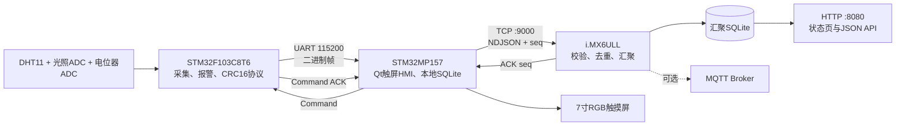

# 三板分布式边缘数据采集网关

[](https://github.com/JiangChngY/EdgeGateway_ThreeBoard/actions/workflows/host-ci.yml)

`STM32F103C8T6 + STM32MP157 + i.MX6ULL` 组成的三级边缘数据采集网关。项目使用现成开发板、USB-TTL、以太网和正点原子7寸RGB触摸屏，无需自制转接PCB，覆盖现场采集、触屏HMI、断网缓存、边缘汇聚与状态服务。

## 总体架构



完整的项目逻辑树、数据上报流程和控制流程见 [项目逻辑与流程图](docs/10_项目逻辑与流程图.md)。

## 三块板的职责

| 节点 | 主要职责 | 关键技术 |
|---|---|---|
| STM32F103C8T6 | DHT11、光照和模拟量采集；现场报警；LED/蜂鸣器控制 | 裸机超循环、SysTick、TIM4、ADC+DMA、UART中断环形缓冲、IWDG、CRC16 |
| STM32MP157 | 7寸触摸HMI、串口协议解析、曲线、历史数据、控制下发、断网缓存 | Qt 5 Widgets、QSerialPort、QTcpSocket、SQLite WAL、信号槽 |
| i.MX6ULL | TCP汇聚、数据去重、网关离线检测、备份存储、状态服务 | Qt 5 Core、QTcpServer、SQLite WAL、最小HTTP服务、常驻MQTT转发进程 |

## 关键设计

- F103与MP157之间使用小端二进制协议：帧头、版本、类型、序号、长度、负载和Modbus CRC16。
- 流式解析器逐字节处理串口数据，支持分片、前导噪声、坏CRC丢弃和下一帧恢复。
- `valid_flags` 区分温湿度、光照、模拟量有效性，并用bit7标识合成演示数据。
- F103报警采用锁存、人工消音和1℃回差，避免复位后下一秒立即重响。
- MP157只有收到F103成功ACK后才提交温度阈值；拒绝、断线或2.5秒超时都会回滚。
- MP157使用SQLite `uplink_queue` 保存未确认上报，TCP重连后按序补传。
- i.MX6ULL以 `(gateway, seq)` 唯一索引完成幂等去重，并提供HTTP页面和JSON API。
- MQTT为可选分支，使用常驻 `mosquitto_pub -l -q 1`，不会每条数据都启动新进程。

## 串口帧

```text
AA 55 | Version | Type | Sequence(2) | Length(2) | Payload(0..64) | CRC16(2)
```

消息类型：

- `0x01`：传感器数据
- `0x02`：心跳
- `0x10`：控制命令
- `0x11`：命令ACK

详见 [串口协议说明](common/协议说明.md)。

## 目录结构

```text
common/                    跨平台C协议
firmware_f103/             STM32F103标准外设库与Keil工程
mp157_hmi/                 STM32MP157 Qt Widgets应用
imx6ull_aggregator/        i.MX6ULL Qt Core后台服务
config/                    两块Linux板的示例配置
deploy/                    构建、安装和systemd服务脚本
tools/                     Python模拟器、串口监视器和辅助工具
tests/                     21项Python测试与C协议运行测试
docs/                      架构、接线、部署、联调和系统演示
.github/workflows/         GitHub Actions自动化持续集成
```

## 快速运行与测试

```bash
git clone https://github.com/JiangChngY/EdgeGateway_ThreeBoard.git
cd EdgeGateway_ThreeBoard
python tests/run_all.py
```

Windows也可以双击 `一键电脑测试.bat`。

模拟i.MX6ULL服务：

```bash
python tools/imx_test_server.py --host 0.0.0.0 --port 9000
```

另开终端模拟MP157上报：

```bash
python tools/mp157_uplink_sim.py --host 127.0.0.1 --port 9000 --count 20
```

## 最简接线

```text
F103 PA9  / USART1_TX  -> USB-TTL RXD
F103 PA10 / USART1_RX  <- USB-TTL TXD
F103 GND               --- USB-TTL GND
USB-TTL USB            ->  MP157 USB Host
MP157 与 i.MX6ULL      ->  同一路由器/交换机
7寸RGB屏               ->  MP157原装RGB排线接口
```

不要把USB-TTL模块的5V或3.3V电源脚接到F103；三块开发板分别使用自己的电源。完整传感器引脚和安全说明见 [接线说明](docs/02_接线说明.md)。

## 编译与部署

| 内容 | 文档 |
|---|---|
| F103 Keil编译与ST-Link烧录 | [docs/03_F103编译烧录.md](docs/03_F103编译烧录.md) |
| STM32MP157 Qt交叉编译与部署 | [docs/04_MP157编译部署.md](docs/04_MP157编译部署.md) |
| i.MX6ULL服务编译与部署 | [docs/05_iMX6ULL编译部署.md](docs/05_iMX6ULL编译部署.md) |
| 协议与网络联调 | [docs/06_协议与网络联调.md](docs/06_协议与网络联调.md) |
| 系统演示 | [docs/07_系统演示.md](docs/07_系统演示.md) |
| 第二轮代码审查修复 | [docs/09_代码审查修复记录.md](docs/09_代码审查修复记录.md) |

默认网络配置：

- i.MX6ULL：`192.168.10.2`
- STM32MP157：`192.168.10.3`
- TCP汇聚：`192.168.10.2:9000`
- HTTP状态页：`http://192.168.10.2:8080/`

## 自动化测试

仓库自动化检查包括：

- 21项Python协议、TCP、工程结构和审查回归测试。
- GCC C99严格编译并运行公共协议测试。
- GitHub Actions中的Qt 5主机编译，用于提前发现Qt API和C++编译错误。
- Linux部署脚本语法检查。

## 第三方代码说明

`firmware_f103/Library` 与 `firmware_f103/Start` 包含STM32标准外设库和CMSIS相关文件，保留了原始版权与许可声明；项目代码未移除这些声明。
