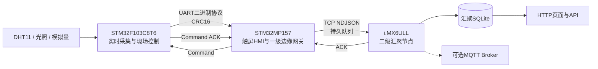
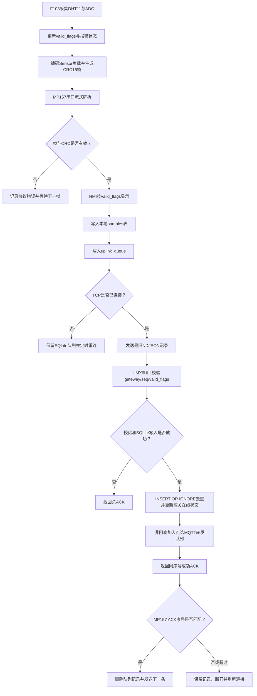
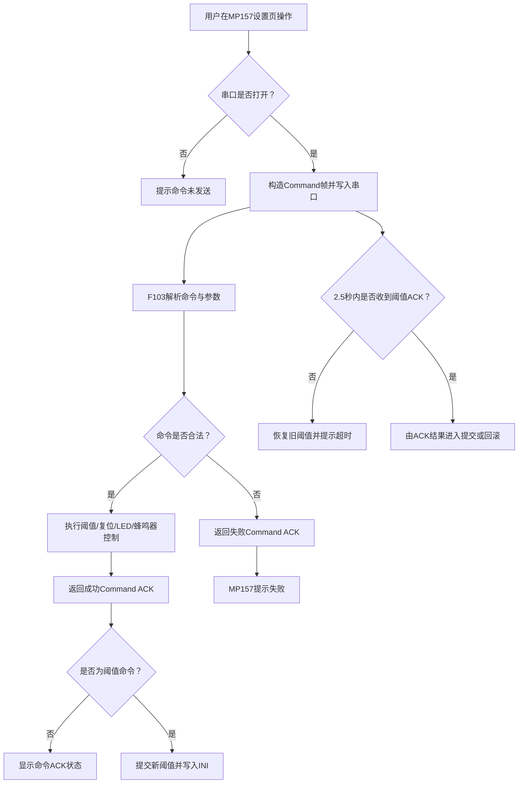
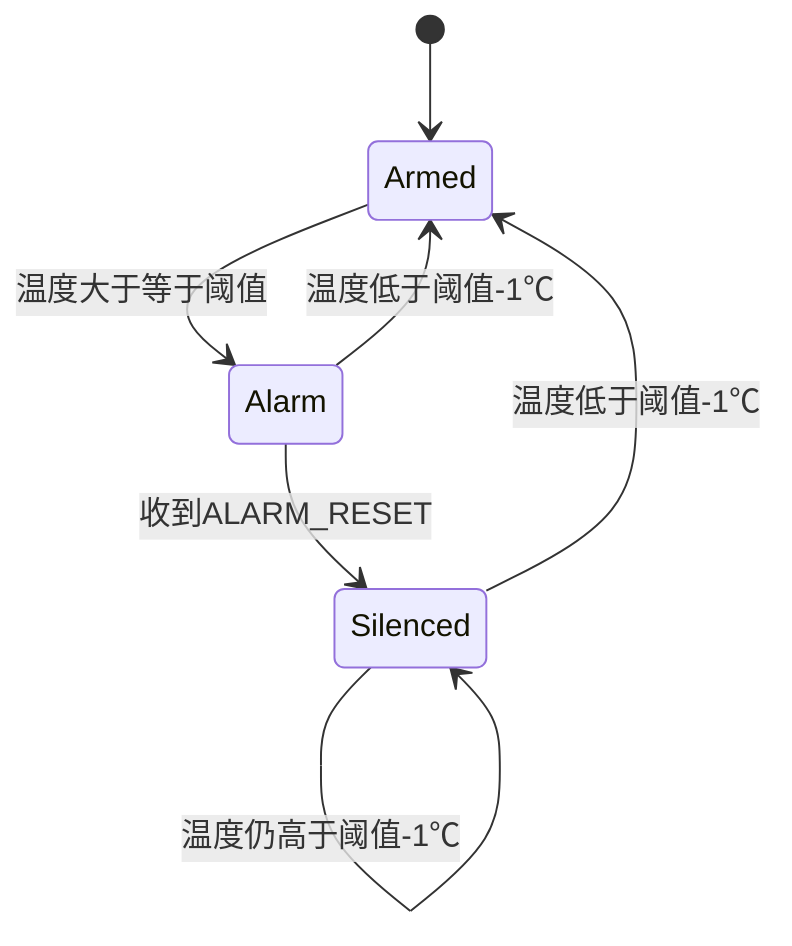

# 项目逻辑与流程图

## 详细逻辑结构

```text
三板分布式边缘数据采集网关 · EdgeGateway_ThreeBoard
│
├── 1. 项目定位
│   ├── 桌面分布式采集与边缘汇聚演示
│   ├── F103(UART 115200) → MP157(TCP NDJSON) → i.MX6ULL
│   └── 默认服务：192.168.10.2:9000(TCP) / 192.168.10.2:8080(HTTP)
│
├── 2. 硬件节点
│   ├── STM32F103C8T6：DHT11、光照ADC、电位器ADC、LED、蜂鸣器
│   ├── STM32MP157：7寸RGB触摸屏、USB-TTL串口、以太网
│   └── i.MX6ULL：以太网汇聚服务、SQLite、HTTP、可选MQTT
│
├── 3. 公共协议层
│   ├── AA55|Version|Type|Sequence|Length|Payload|CRC16，小端序
│   ├── Sensor / Heartbeat / Command / Command ACK
│   ├── 流式解析、噪声重同步、坏CRC恢复
│   ├── valid_flags：bit0温湿度、bit1光照、bit2模拟量、bit7合成数据
│   └── eg_build_frame兼容接口 + eg_build_frame_ex详细错误码
│
├── 4. F103采集端
│   ├── C语言、STM32标准外设库、裸机超循环、IWDG
│   ├── SysTick 1ms + TIM4 1MHz微秒计数器
│   ├── 每2秒测量DHT11高脉宽；默认失败时生成合成演示数据
│   ├── 每1秒采集ADC、更新报警状态并发送Sensor帧
│   ├── 每5秒发送Heartbeat帧
│   ├── UART中断环形缓冲 → 流式解析器 → 命令分发
│   └── 报警复位消音；低于“阈值-1℃”后重新布防
│
├── 5. MP157 HMI端
│   ├── Qt 5 Widgets：实时监控、历史数据、设备设置
│   ├── QSerialPort接收二进制帧并复用公共C解析器
│   ├── valid_flags控制显示、入库NULL和报警判断
│   ├── SQLite WAL：samples / alarms / uplink_queue
│   ├── NDJSON逐行上报，使用独立上行序号
│   ├── ACK匹配后删除队首；3秒超时断开并重连补传
│   └── 阈值命令等待2.5秒ACK；成功持久化，失败/超时/断线回滚
│
├── 6. i.MX6ULL汇聚端
│   ├── QTcpServer多客户端独立缓冲，TCP端口9000
│   ├── 完整超长行返回负ACK；无终止符超过64KiB则负ACK后断开
│   ├── valid_flags要求对应有效字段为JSON number
│   ├── SQLite WAL与(gateway,seq)唯一索引去重
│   ├── 每5秒扫描，默认15秒无数据标记网关离线
│   ├── 常驻mosquitto_pub -l -q 1可选MQTT转发
│   └── HTTP端口8080：页面、/api/status、/api/latest、CORS与OPTIONS
│
├── 7. 数据可靠性
│   ├── 串口：帧序号 + 长度 + CRC16 + 流式重同步
│   ├── MP157：SQLite持久队列 + ACK删除 + 超时重连
│   ├── i.MX6ULL：唯一索引幂等去重 + 原始JSON留档
│   └── MQTT失败不影响i.MX6ULL的SQLite主副本和TCP ACK链路
│
└── 8. 测试体系
│   ├── 21项Python协议、TCP、结构和审查回归测试
│   ├── 公共C协议GCC C99严格编译与运行测试
│   ├── GitHub Actions Qt 5主机编译
│   └── Linux部署脚本sh语法检查
```

## 总体架构图



HTTP与MQTT是i.MX6ULL汇聚后的两个独立消费分支；HTTP不依赖MQTT。MQTT异常时，SQLite主副本和TCP ACK链路仍可继续工作。

## 数据上报流程图



## 控制闭环流程图



## 报警状态机


