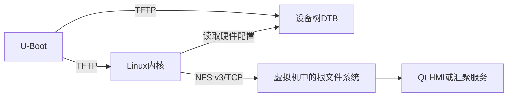

# STM32MP157与i.MX6ULL的TFTP/NFS网络启动

## 1. 启动方式

两块板都保留原来的本地启动命令。调试时在U-Boot倒计时阶段按任意键，手动执行网络启动；调试结束后复位即可恢复原来的eMMC或NAND启动。



已编译镜像位于 `bsp_netboot/artifacts`。当前采用两张专用虚拟网卡，地址分别为：

```text
STM32MP157  ens37  192.168.137.2/24  板端192.168.137.3
i.MX6ULL    ens38  192.168.138.2/24  板端192.168.138.3
```

对应NFS路径是 `192.168.137.2:/srv/nfs/edgegateway/mp157` 和
`192.168.138.2:/srv/nfs/edgegateway/imx6ull`。

## 2. VMware网络设置

`ens33` 保持NAT和DHCP，只负责Ubuntu上网及从Windows SSH进入虚拟机。`ens37`、
`ens38` 只负责开发板网络启动，不设置网关和DNS，避免抢占默认路由。用户一次只连接一块
开发板，因此把网线接到当前调试的板即可，不需要USB OTG线。

Ubuntu中检查三张网卡：

```bash
ip -br address show ens33
ip -br address show ens37
ip -br address show ens38
ip route
```

默认路由只能走 `ens33`。调试MP157时启用连接 `edge-mp157`，调试6ULL时启用
`edge-imx6ull`。两张专用网卡都不需要网关。

## 3. 服务器检查

Ubuntu中执行：

```bash
systemctl status tftpd-hpa nfs-kernel-server rpcbind --no-pager
showmount -e 127.0.0.1
bash bsp_netboot/scripts/verify_server.sh 127.0.0.1
```

应该能看到两条NFS导出，并提示TFTP下载和两份NFS根文件系统均可用。

部署脚本会同时安装与当前内核完全匹配的模块。i.MX6ULL默认使用eMMC版模块；如果开发板是NAND版，应执行：

```bash
IMX_VARIANT=nand bash bsp_netboot/scripts/prepare_server.sh ~/edgegateway_bsp
```

eMMC与NAND内核的版本号相同但配置不同，切换存储版本时也要重新执行上面的部署命令，不能只替换 `zImage` 和DTB。

## 4. 不更换U-Boot，直接试启动

这是第一次上板时最稳妥的办法：仍使用板上原来的U-Boot，只临时输入网络启动命令。

### 4.1 STM32MP157

```text
setenv ipaddr 192.168.137.3
setenv serverip 192.168.137.2
setenv netmask 255.255.255.0
tftpboot 0xc2000000 mp157/uImage
tftpboot 0xc4000000 mp157/stm32mp157d-atk-edgegateway.dtb
setenv bootargs 'console=ttySTM0,115200 root=/dev/nfs rw nfsroot=192.168.137.2:/srv/nfs/edgegateway/mp157,vers=3,tcp ip=192.168.137.3:192.168.137.2::255.255.255.0:mp157-edge:eth0:off rootwait'
bootm 0xc2000000 - 0xc4000000
```

### 4.2 i.MX6ULL eMMC版本

```text
setenv ipaddr 192.168.138.3
setenv serverip 192.168.138.2
setenv netmask 255.255.255.0
tftp 0x80800000 imx6ull/emmc/zImage
tftp 0x83000000 imx6ull/emmc/imx6ull-alientek-emmc-edgegateway.dtb
setenv bootargs 'console=ttymxc0,115200 root=/dev/nfs rw nfsroot=192.168.138.2:/srv/nfs/edgegateway/imx6ull,vers=3,tcp ip=192.168.138.3:192.168.138.2::255.255.255.0:imx6ull-edge:eth0:off rootwait'
bootz 0x80800000 - 0x83000000
```

### 4.3 i.MX6ULL NAND版本

```text
setenv ipaddr 192.168.138.3
setenv serverip 192.168.138.2
setenv netmask 255.255.255.0
tftp 0x80800000 imx6ull/nand/zImage
tftp 0x83000000 imx6ull/nand/imx6ull-alientek-nand-edgegateway.dtb
setenv bootargs 'console=ttymxc0,115200 root=/dev/nfs rw nfsroot=192.168.138.2:/srv/nfs/edgegateway/imx6ull,vers=3,tcp ip=192.168.138.3:192.168.138.2::255.255.255.0:imx6ull-edge:eth0:off rootwait'
bootz 0x80800000 - 0x83000000
```

命令中的地址是DDR加载地址，不会写入eMMC或NAND，断电后不会留下修改。

## 5. 使用已编译的新U-Boot

新U-Boot增加了 `edge_netboot`，但没有修改默认 `bootcmd`。按开发板原来的升级方法写入对应U-Boot后，先备份环境：

```text
printenv
```

如果Flash里仍保存着旧环境，新增加的变量不会自动出现。确认可以重置环境后执行：

```text
env default -a
saveenv
reset
```

再次进入U-Boot后执行：

```text
setenv edge_serverip 192.168.138.2
setenv edge_ipaddr 192.168.138.3
setenv edge_ip_method static
setenv serverip 192.168.138.2
saveenv
run edge_netboot
```

STM32MP157的 `u-boot.stm32` 应按正点原子原有的TF-A/STM32CubeProgrammer分区烧写流程更新；i.MX6ULL的 `u-boot.imx` 应按开发板存储类型使用原有的eMMC或NAND更新流程。不要把U-Boot镜像当作Linux内核直接执行，也不要把eMMC和NAND版本混用。

## 6. 判断启动是否成功

串口中依次出现以下信息即可说明链路正常：

1. DHCP获得开发板地址。
2. TFTP显示内核和DTB下载字节数。
3. 内核日志出现 `VFS: Mounted root (nfs filesystem)` 或同类信息。
4. 进入NFS根文件系统的Shell。

若TFTP超时，先检查是否同网段、虚拟机是否桥接、网线和服务器防火墙。若内核已经启动但停在 `Waiting for root device /dev/nfs`，重点检查NFS导出路径、RPC端口、启动参数里的服务器地址以及网卡驱动日志。

## 7. 恢复本地启动

因为网络启动是手工触发，直接复位并让U-Boot倒计时结束即可回到原本的 `bootcmd`。如果之前把 `bootcmd` 改成了网络启动，可在U-Boot执行：

```text
env default bootcmd
saveenv
reset
```

执行前先用 `printenv bootcmd` 确认当前内容，避免覆盖开发板原有的自定义启动项。
